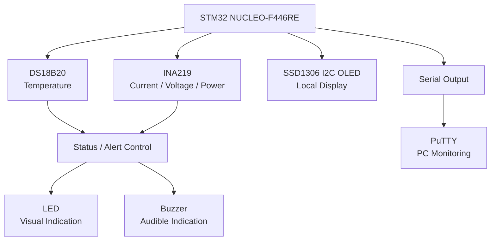
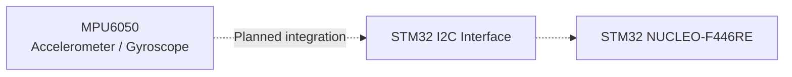
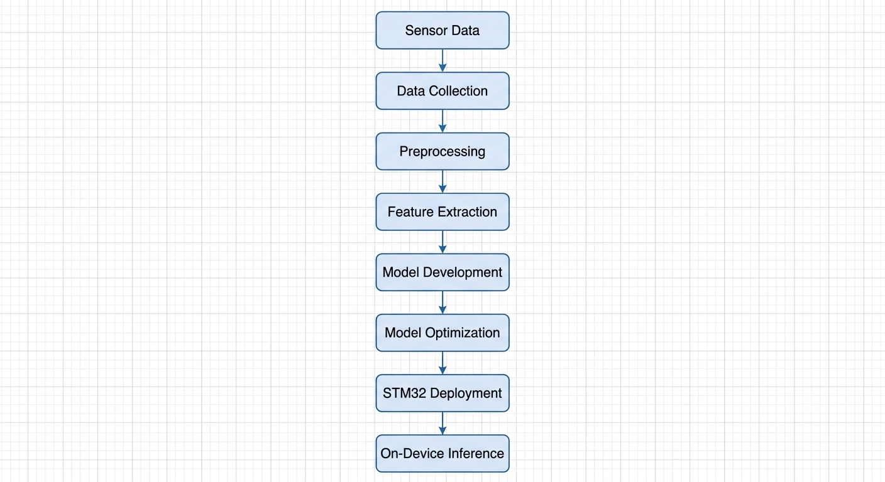

# STM32-Based Lightweight Edge AI for Multisensor Industrial Condition Monitoring

**BEC 753 – Project - I | 7th Semester Project**

**Project Team**
- **Aman Shukla** — Project Team Lead
- **Govind Shukla** — Project Team Member

## Overview

This project focuses on developing a multisensor embedded monitoring system around the **STM32 NUCLEO-F446RE**. The system is being developed incrementally, beginning with verified sensor/peripheral interfacing and local monitoring before moving toward motion/vibration integration, multisensor data processing, and lightweight Edge AI.

The repository documents the **actual validated development status** and does not mark planned features as completed.

## Software and Development Tools

| Software / Tool | Version / Use |
|---|---|
| **STM32CubeIDE** | **v2.2.0** — STM32 project development, build, flash, and debugging |
| **PuTTY** | Serial terminal for monitoring STM32 output |

STM32CubeIDE is STMicroelectronics' integrated development environment for STM32 microcontrollers and supports the development, build, programming, and debugging workflow. citeturn0search1turn0search6

PuTTY is used as the PC-side serial terminal to observe data transmitted by the STM32 over the project's serial interface. The COM port and serial parameters depend on the actual board and firmware configuration. citeturn0search0turn0search13

## Current Hardware Status

### Completed and Working

The current hardware work has been completed and verified up to the following integration:

- **STM32 NUCLEO-F446RE** — main microcontroller board
- **DS18B20** — temperature sensing
- **INA219** — current, bus-voltage, and power monitoring
- **SSD1306 I2C OLED** — local display
- **Buzzer** — audible status indication
- **LED + series resistor** — visual status/output indication
- **PuTTY serial display** — PC-side monitoring of STM32 output

These peripherals are currently part of the working STM32 monitoring setup.

### Next Hardware Integration

- **MPU6050** — next integration target for accelerometer/gyroscope data

The MPU6050 module has already been independently checked using an Arduino UNO and was found responding at I2C address **0x68**, with accelerometer, gyroscope, and temperature readings. The next step is to integrate and validate the MPU6050 on the **STM32 NUCLEO-F446RE** setup.

Until that STM32 integration is validated, the MPU6050 is **not considered part of the completed working STM32 hardware stack**.

## Current Firmware Status

Firmware is being developed in **Embedded C** for the STM32 NUCLEO-F446RE.

The currently validated work covers:

- STM32 peripheral initialization and firmware development
- DS18B20 temperature acquisition
- INA219 electrical measurement
- SSD1306 I2C OLED output
- Buzzer control
- LED/status output
- Serial output monitored through PuTTY
- Hardware bring-up and debugging

The current implementation is focused on reliable sensor/peripheral interfacing and monitoring. **Condition-classification logic, TinyML/Edge AI inference, CAN/RS485 communication, and other planned functions are not represented as completed features unless separately validated.**

## Current Hardware Architecture

The current system is organized around the **STM32 NUCLEO-F446RE**, which acquires sensor data, processes the measurements, provides local status indication, and sends monitoring data to a PC through the serial interface.

### Validated Hardware Architecture



The architecture above represents the **currently validated STM32 hardware and monitoring path**. The STM32 NUCLEO-F446RE acts as the central controller for temperature sensing, electrical monitoring, local display, status indication, and serial data monitoring.

### Planned Motion / Vibration Integration

The **MPU6050** is the next sensor planned for integration. It will provide accelerometer and gyroscope measurements for the motion/vibration condition-monitoring stage.



The MPU6050 is **not shown as part of the completed hardware path** until its STM32-side I2C integration is successfully tested and validated.

## MPU6050 Integration Status

The MPU6050 is intended to provide motion/vibration-related measurements for the condition-monitoring stage.

Current status:

1. Sensor module independently verified with Arduino UNO.
2. I2C address confirmed as **0x68**.
3. Accelerometer, gyroscope, and temperature readings observed during the independent test.
4. STM32-side integration is the **next hardware step**.
5. Final integration status will be updated only after successful STM32 testing.

Detailed bring-up notes are documented in `firmware/MPU6050.md`.

## Planned Edge AI Workflow

The project is planned to evolve from validated multisensor acquisition toward a lightweight **Edge AI condition-monitoring pipeline**. The intended workflow is:



### Pipeline Stages

1. **Sensor Data** — Acquire temperature, electrical, and motion/vibration measurements from the connected sensors.
2. **Data Collection** — Capture and organize sensor measurements for analysis and model development.
3. **Preprocessing** — Clean, synchronize, normalize, and prepare the acquired data.
4. **Feature Extraction** — Derive relevant time-domain and frequency-domain features from the processed sensor signals.
5. **Model Development** — Train and evaluate a lightweight machine-learning model using representative condition-monitoring data.
6. **Model Optimization** — Reduce model size and computational requirements for resource-constrained embedded deployment.
7. **STM32 Deployment** — Convert and integrate the optimized model for execution on the target STM32 platform.
8. **On-Device Inference** — Run inference locally on the STM32 and use the model output for condition-monitoring decisions.

This workflow represents the **planned development path**. Model training, optimization, STM32 deployment, and on-device Edge AI inference are **not currently claimed as completed features**.

## Future Hardware / Communication Work

The following items are part of the broader project plan and are **not included in the current completed hardware status**:

- CAN interface using SN65HVD230 transceivers
- RS485 interface using MAX3485
- A3144 Hall sensor
- N20 6V 100 RPM encoder motor
- L298N motor driver
- Relay module
- LM2596 power module

They will be documented separately when actually integrated and tested.

## Project Status

**Status: Ongoing — hardware bring-up and multisensor integration**

### Current milestone

**Completed working STM32 setup:**
DS18B20 + INA219 + SSD1306 OLED + buzzer + LED/resistor + serial monitoring through PuTTY.

### Next milestone

**STM32 integration and validation of MPU6050 at I2C address 0x68.**

After the MPU6050 integration is validated, the project can proceed toward synchronized multisensor data acquisition, feature extraction, and subsequent Edge AI development.

## Repository Structure

```text
stm32-edge-ai-condition-monitoring/
├── README.md
├── firmware/
│   └── MPU6050.md
└── images/
```

## Academic Information

**Course:** BEC 753 – Project - I  
**Semester:** 7th Semester  
**Program:** Bachelor of Technology – Electronics Engineering  
**Project Type:** Academic Project  
**Status:** Ongoing
