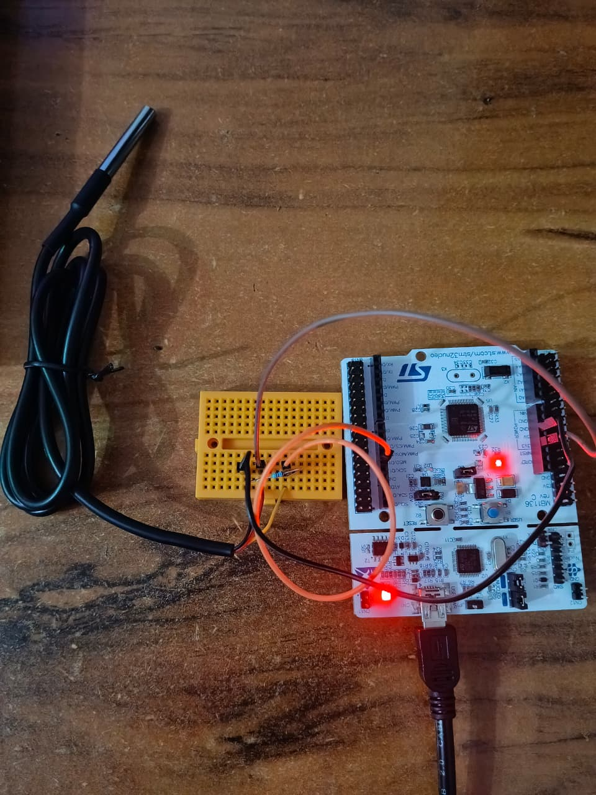
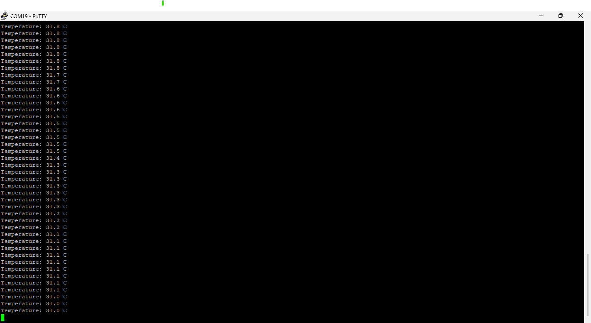

# STM32F446RE DS18B20 Temperature Monitoring

Bare-metal STM32F446RE firmware for reading temperature from a DS18B20 digital temperature sensor using a 1-Wire interface and sending the measured value through USART2.

## Hardware

- STM32F446RE NUCLEO board
- DS18B20 temperature sensor
- 4.7 kΩ pull-up resistor on the DS18B20 data line
- USB connection for serial monitoring

## Pin Connections

| Device | STM32F446RE |
|---|---|
| DS18B20 DATA | PA6 |
| DS18B20 VCC | 3.3 V |
| DS18B20 GND | GND |
| USART2 TX | PA2 |

## Firmware

- MCU clock: 16 MHz HSI
- DS18B20 interface: 1-Wire bit-banging
- Temperature resolution: 12-bit
- USART2: 115200 baud, 8-N-1
- Delay source: SysTick
- Register-level bare-metal C
- No HAL or external sensor library

## Serial Output

The firmware reports the measured temperature once per second:

```text
================================
STM32F446RE DS18B20 MONITOR
UART2: 115200 8N1
DS18B20: PA6
================================
Temperature: 28.1 C
```

If the sensor is not detected, the firmware reports:

```text
DS18B20 not detected!
```

## Hardware Verification

The firmware was tested on an STM32F446RE with a DS18B20 temperature sensor connected to PA6. The hardware setup is shown below.



## Serial Monitoring

Temperature data is transmitted through USART2 and can be monitored using a serial terminal such as PuTTY at 115200 baud, 8-N-1.



## Verification

The temperature reading was verified on physical STM32F446RE hardware through the DS18B20 sensor and USART2 serial output.