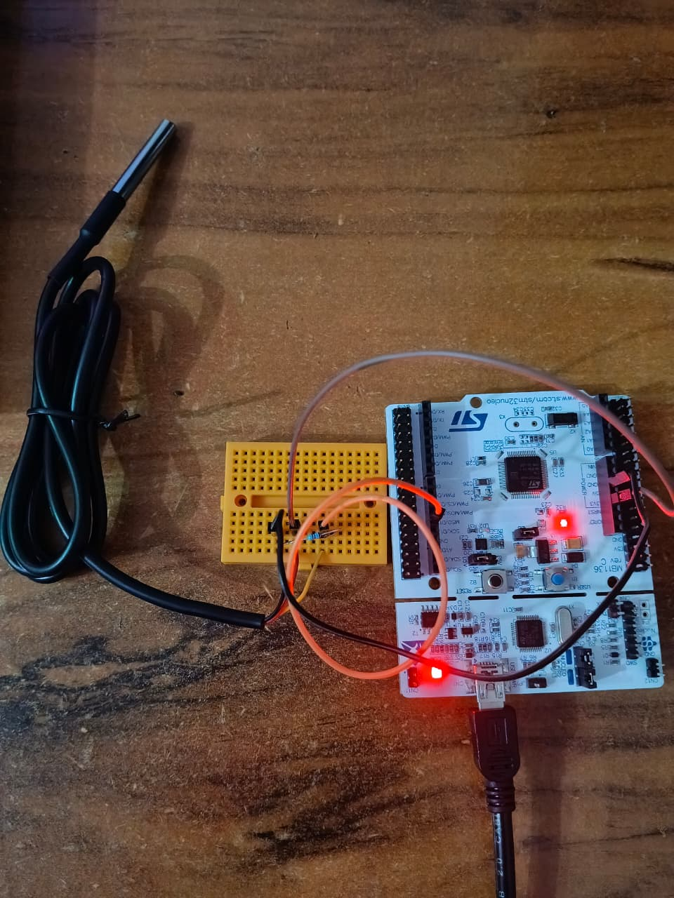
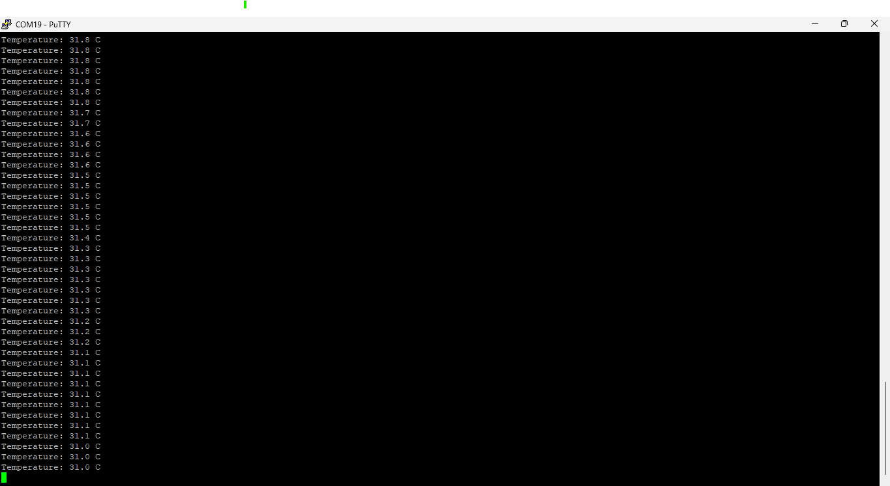

# STM32F446RE DS18B20 Temperature Monitoring

Bare-metal STM32F446RE firmware for reading temperature from a **DS18B20** digital sensor over a 1-Wire interface and reporting the result through USART2.

## Objective

Demonstrate a small, modular embedded firmware application using direct register-level programming without STM32 HAL or an external sensor library.

## Hardware

- STM32 NUCLEO-F446RE
- DS18B20 temperature sensor
- 4.7 kΩ pull-up resistor
- USB connection for serial monitoring

## Pin Connections

| Device | STM32F446RE |
|---|---|
| DS18B20 DATA | PA6 |
| DS18B20 VCC | 3.3 V |
| DS18B20 GND | GND |
| USART2 TX | PA2 |

## Firmware Structure

```text
02-ds18b20-temperature/
├── main.c
├── delay.c
├── delay.h
├── onewire.c
├── onewire.h
├── ds18b20.c
├── ds18b20.h
├── uart.c
├── uart.h
└── README.md
```

### Module responsibilities

- **main.c** — application flow and periodic temperature monitoring.
- **delay.c / delay.h** — SysTick-based microsecond timing.
- **onewire.c / onewire.h** — low-level 1-Wire bus transactions on PA6.
- **ds18b20.c / ds18b20.h** — DS18B20 commands and temperature conversion.
- **uart.c / uart.h** — USART2 initialization and serial output formatting.

This keeps hardware-specific protocol code out of `main.c` while retaining a simple, readable application layer.

## Firmware Features

- 1-Wire communication using GPIO bit-banging
- DS18B20 temperature conversion at 12-bit resolution
- USART2 at 115200 baud, 8-N-1
- SysTick-based microsecond timing
- Direct register-level C
- No STM32 HAL or external sensor library
- Sensor-not-detected handling

## Serial Output

The measured temperature is transmitted once per second:

```text
================================
STM32F446RE DS18B20 MONITOR
UART2: 115200 8N1
DS18B20: PA6
================================
Temperature: 28.1 C
```

If the sensor is not detected:

```text
DS18B20 not detected!
```

## Hardware Test

The firmware was tested on an STM32F446RE with the DS18B20 connected to PA6.



## Serial Monitoring

Temperature readings are monitored through **USART2** using PuTTY at **115200 baud, 8-N-1**.



## Design Note

The firmware is intentionally kept at register level to expose the STM32 peripheral configuration and 1-Wire timing. The module boundaries are based on actual responsibilities rather than creating a separate file for every small function.
