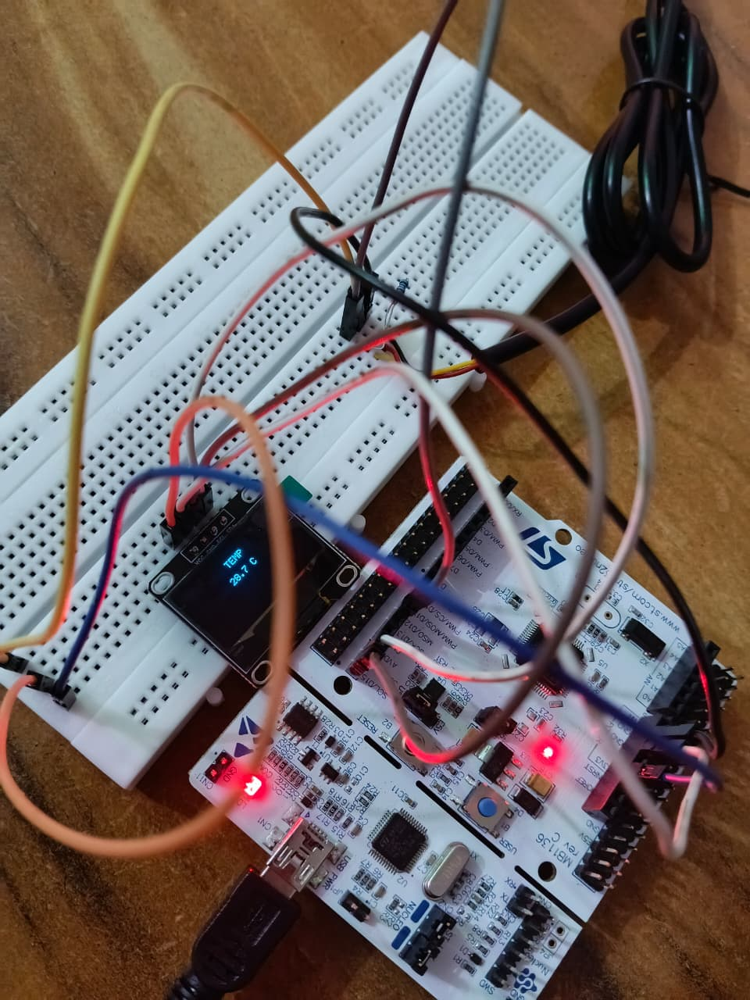

# STM32F446RE DS18B20 + SSD1306 OLED Temperature Monitoring

## Overview

Bare-metal STM32F446RE firmware for integrating a **DS18B20 digital temperature sensor** with a **0.96-inch SSD1306 I2C OLED**.

The firmware reads the DS18B20 temperature over a 1-Wire interface, displays the result on the OLED, and sends the same reading to a PC terminal through USART2.

This folder is the **DS18B20 + OLED integration test** within the firmware development sequence.

## Hardware

- STM32 NUCLEO-F446RE
- DS18B20 temperature sensor
- SSD1306 0.96-inch I2C OLED
- USB connection to PC for serial monitoring
- 4.7 kΩ pull-up resistor for the DS18B20 data line
- Breadboard and jumper wires

## Connections

| Device | STM32F446RE Pin | Interface / Function |
|---|---|---|
| DS18B20 DATA | **PA6** | 1-Wire |
| DS18B20 VCC | **3.3 V** | Power |
| DS18B20 GND | **GND** | Ground |
| DS18B20 DATA pull-up | **4.7 kΩ to 3.3 V** | 1-Wire pull-up |
| OLED SCL | **PB8** | I2C1 SCL |
| OLED SDA | **PB9** | I2C1 SDA |
| OLED VCC | **3.3 V** | Power |
| OLED GND | **GND** | Ground |
| USART2 TX | **PA2** | Serial output |

OLED I2C address: **0x3C**

USART2 configuration:

- Baud rate: **115200**
- Data: **8 bits**
- Parity: **None**
- Stop bits: **1**

## Firmware Architecture

```text
                 STM32F446RE
                     │
          ┌──────────┴──────────┐
          │                     │
       PA6 1-Wire             I2C1
          │                  PB8/PB9
          ▼                     │
       DS18B20                  ▼
    Temperature            SSD1306 OLED
          │
          └──────────┐
                     │
                  USART2
                     │
                     ▼
                 PC / PuTTY
```

## Firmware Features

- Register-level STM32F446RE programming
- No STM32 HAL or external libraries
- DS18B20 1-Wire reset, read, and temperature conversion
- SSD1306 initialization and text output over I2C1
- USART2 serial output at 115200 baud
- SysTick-based microsecond delays
- DS18B20 presence/error detection
- Temperature display on OLED
- Continuous temperature monitoring

## OLED Output

When the DS18B20 is detected, the OLED is intended to display:

```text
        TEMP

       28.7 C
```

The displayed value changes according to the measured temperature.

If the DS18B20 is not detected:

```text
        TEMP

        ERR
```

## PuTTY Output

The firmware sends startup information and temperature readings through USART2:

```text
================================
STM32F446RE DS18B20 + OLED
UART2: 115200 8N1
DS18B20: PA6
OLED: I2C1 PB8/PB9
================================
Temperature: 28.7 C
```

## Current Status

This firmware represents the **combined DS18B20 + OLED integration stage**.

- **DS18B20 interface:** implemented in `main.c`
- **SSD1306 I2C interface:** implemented in `main.c`
- **USART2 monitoring:** implemented in `main.c`
- **Hardware validation:** ongoing during peripheral bring-up

The firmware should therefore be treated as an **integration test**, rather than as the final condition-monitoring firmware.

## Source

- `main.c` — complete register-level implementation for DS18B20, I2C1/SSD1306 OLED, and USART2.

## Hardware Setup



Hardware setup image for this DS18B20 + OLED integration stage.
