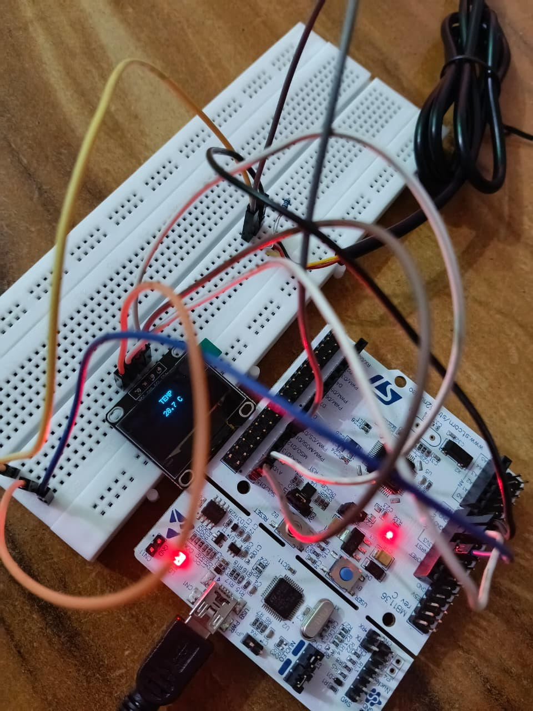

# STM32F446RE DS18B20 + SSD1306 OLED Temperature Monitoring

Bare-metal STM32F446RE firmware integrating a **DS18B20** temperature sensor with a **0.96-inch SSD1306 I2C OLED**.

## Hardware

- STM32 NUCLEO-F446RE
- DS18B20
- 4.7 kΩ pull-up resistor
- SSD1306 0.96-inch I2C OLED

## Connections

| Device | STM32F446RE | Function |
|---|---|---|
| DS18B20 DATA | PA6 | 1-Wire |
| OLED SCL | PB8 | I2C1 SCL |
| OLED SDA | PB9 | I2C1 SDA |
| USART2 TX | PA2 | Serial output |

DS18B20 VCC → 3.3 V, GND → GND. OLED address: **0x3C**. USART2: **115200, 8-N-1**.

## Firmware Structure

```text
03-ds18b20-oled-temperature/
├── main.c
├── delay.c / delay.h
├── onewire.c / onewire.h
├── ds18b20.c / ds18b20.h
├── i2c.c / i2c.h
├── oled.c / oled.h
├── uart.c / uart.h
├── images/
└── README.md
```

### Module responsibilities

- **main.c** — application flow and periodic monitoring.
- **delay.c/.h** — SysTick timing.
- **onewire.c/.h** — 1-Wire transactions on PA6.
- **ds18b20.c/.h** — DS18B20 temperature conversion.
- **i2c.c/.h** — register-level I2C1 master on PB8/PB9.
- **oled.c/.h** — SSD1306 initialization and text rendering.
- **uart.c/.h** — USART2 serial output.

## Firmware Features

- Direct STM32F446RE register programming
- No STM32 HAL or external sensor/display libraries
- DS18B20 1-Wire communication
- SSD1306 OLED over I2C1
- USART2 serial monitoring
- SysTick microsecond timing
- Sensor error indication

## Output

Normal OLED output:

```text
        TEMP

       28.7 C
```

Sensor error:

```text
        TEMP

        ERR
```

Serial output:

```text
================================
STM32F446RE DS18B20 + OLED
UART2: 115200 8N1
DS18B20: PA6
OLED: I2C1 PB8/PB9
================================
Temperature: 28.7 C
```

## Hardware Evidence



The existing hardware/test images are retained in the `images/` directory.

## Design Note

This stage introduces separate I2C and OLED modules because the application now combines multiple peripheral responsibilities. The module boundaries reflect actual driver responsibilities while keeping `main.c` focused on application behavior.
